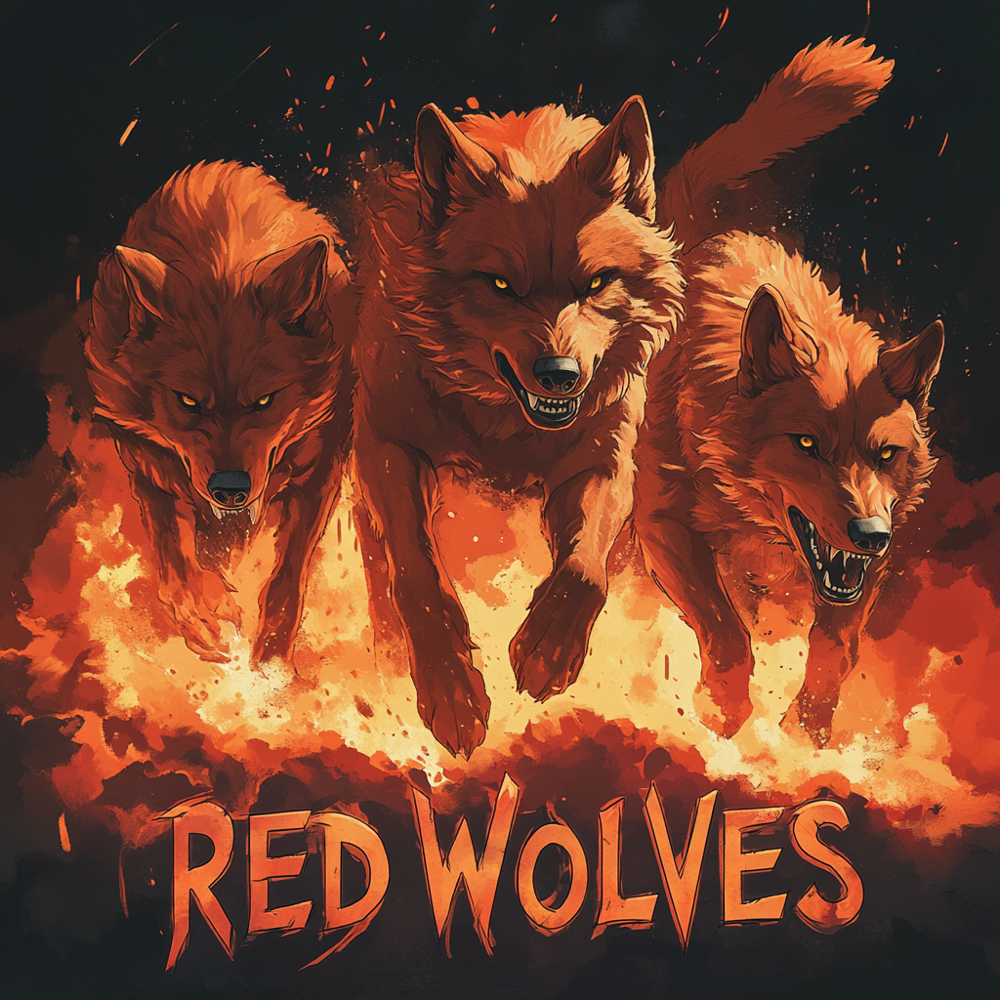

# RED WOLVES FREE FIRE

**Элитная гильдия, где каждый игрок - часть волчьей стаи**

## О нас

RED WOLVES - элитное сообщество игроков FREE FIRE, где каждый участник вносит свой вклад в общий успех. Мы не просто играем - мы доминируем на поле боя.

### Наши достижения
- Чемпионы региональных турниров 2023
- Топ-3 национальных соревнований
- 100+ побед в Guild Wars
- Высший ранг в лиге гильдий

## Требования

**Игровые навыки:**
- Уровень: 45+
- K/D: от 2.5
- Опыт турниров
- Хорошее знание карт и механик

**Личные качества:**
- Командный дух
- Стремление к развитию
- Активность в игре
- Готовность к тренировкам

## Что мы предлагаем

- Профессиональные тренировки
- Участие в турнирах
- Система наставничества
- Дружное коммьюнити
- Тактические тренировки

## Как вступить

1. Напишите [@BELYI94](https://t.me/BELYI94) в Telegram
2. Предоставьте скриншоты статистики
3. Пройдите тестовые игры
4. Получите решение о вступлении

## Контакты

- **Вступление в гильдию:** [@BELYI94](https://t.me/BELYI94)
- **Техническая поддержка:** [@swensi17](https://t.me/swensi17)

---

  <h3>RED WOLVES - Сила в единстве</h3>
  Разработка сайта: <a href="https://t.me/swensi17">@swensi17</a>

